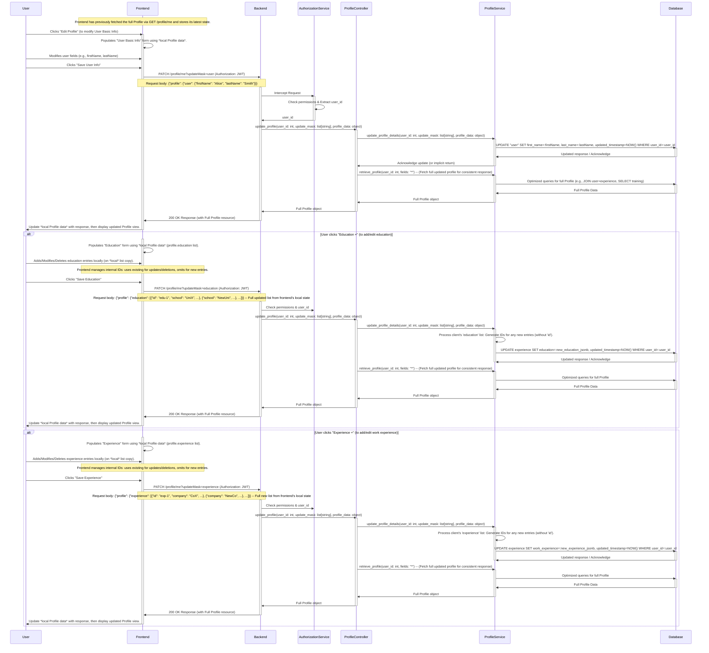

```mermaid
sequenceDiagram
    participant User
    participant Frontend
    participant BE as Backend
    participant AS as AuthorizationService
    participant PC as ProfileController
    participant PS as ProfileService
    participant DB as Database
 

    Note over Frontend: Frontend has previously fetched the full Profile via GET /profile/me and stores its latest state.

    User->>Frontend: Clicks "Edit Profile" (to modify User Basic Info)
    activate Frontend
    Frontend->>Frontend: Populates "User Basic Info" form using *local Profile data*.
    User->>Frontend: Modifies user fields (e.g., firstName, lastName)
    User->>Frontend: Clicks "Save User Info"
    
    Frontend->>BE: PATCH /profile/me?updateMask=user (Authorization: JWT)
    Note over Frontend,BE: Request body: {"profile": {"user": {"firstName": "Alice", "lastName": "Smith"}}}
    
    activate BE
    BE->>AS: Intercept Request
    activate AS
    AS->>AS: Check permissions & Extract user_id
    AS->>BE: user_id
    deactivate AS

    BE->>PC: update_profile(user_id: int, update_mask: list[string], profile_data: object)
    activate PC
    PC->>PS: update_profile_details(user_id: int, update_mask: list[string], profile_data: object)
    activate PS
    
    PS->>DB: UPDATE "user" SET first_name=:firstName, last_name=:lastName, updated_timestamp=NOW() WHERE user_id=:user_id
    activate DB
    
    DB->>PS: Updated response / Acknowledge
    deactivate DB

    PS->>PC: Acknowledge update (or implicit return)
    deactivate PS

    PC->>PS: retrieve_profile(user_id: int, fields: "*") -- (Fetch full updated profile for consistent response)
    activate PS
    PS->>DB: Optimized queries for full Profile (e.g., JOIN user+experience, SELECT training)
    activate DB
    DB->>PS: Full Profile Data
    deactivate DB
    PS->>PC: Full Profile object
    deactivate PS
    PC->>BE: Full Profile object
    deactivate PC

    BE->>Frontend: 200 OK Response (with Full Profile resource)
    deactivate BE
    Frontend->>User: Update *local Profile data* with response, then display updated Profile view.
    deactivate Frontend

    
    alt User clicks "Education +" (to add/edit education)
        activate Frontend
        Frontend->>Frontend: Populates "Education" form using *local Profile data* (profile.education list).
        User->>Frontend: Adds/Modifies/Deletes education entries locally (on *local* list copy).
        Note over Frontend: Frontend manages internal IDs: uses existing for updates/deletions, omits for new entries.
        User->>Frontend: Clicks "Save Education"
        
        Frontend->>BE: PATCH /profile/me?updateMask=education (Authorization: JWT)
        Note over Frontend,BE: Request body: {"profile": {"education": [{"id": "edu-1", "school": "UniX", ...}, {"school": "NewUni", ...}, ...]}} -- Full updated list from frontend's local state
        
        activate BE
        BE->>AS: Check permissions & user_id
        BE->>PC: update_profile(user_id: int, update_mask: list[string], profile_data: object)
        activate PC
        PC->>PS: update_profile_details(user_id: int, update_mask: list[string], profile_data: object)
        activate PS
        PS->>PS: Process client's 'education' list: Generate IDs for any new entries (without 'id').
        PS->>DB: UPDATE experience SET education=:new_education_jsonb, updated_timestamp=NOW() WHERE user_id=:user_id
        activate DB
        DB->>PS: Updated response / Acknowledge
        deactivate DB
        deactivate PS
        
        PC->>PS: retrieve_profile(user_id: int, fields: "*") -- (Fetch full updated profile for consistent response)
        activate PS
        PS->>DB: Optimized queries for full Profile
        activate DB
        DB->>PS: Full Profile Data
        deactivate DB
        PS->>PC: Full Profile object
        deactivate PS
        PC->>BE: Full Profile object
        deactivate PC

        BE->>Frontend: 200 OK Response (with Full Profile resource)
        deactivate BE
        Frontend->>User: Update *local Profile data* with response, then display updated Profile view.
        deactivate Frontend
    end
    
    alt User clicks "Experience +" (to add/edit work experience)
        activate Frontend
        Frontend->>Frontend: Populates "Experience" form using *local Profile data* (profile.experience list).
        User->>Frontend: Adds/Modifies/Deletes experience entries locally (on *local* list copy).
        Note over Frontend: Frontend manages internal IDs: uses existing for updates/deletions, omits for new entries.
        User->>Frontend: Clicks "Save Experience"
        
        Frontend->>BE: PATCH /profile/me?updateMask=experience (Authorization: JWT)
        Note over Frontend,BE: Request body: {"profile": {"experience": [{"id": "exp-1", "company": "CoX", ...}, {"company": "NewCo", ...}, ...]}} -- Full new list from frontend's local state
        
        activate BE
        BE->>AS: Check permissions & user_id
        BE->>PC: update_profile(user_id: int, update_mask: list[string], profile_data: object)
        activate PC
        PC->>PS: update_profile_details(user_id: int, update_mask: list[string], profile_data: object)
        activate PS
        PS->>PS: Process client's 'experience' list: Generate IDs for any new entries (without 'id').
        PS->>DB: UPDATE experience SET work_experience=:new_experience_jsonb, updated_timestamp=NOW() WHERE user_id=:user_id
        activate DB
        DB->>PS: Updated response / Acknowledge
        deactivate DB
        deactivate PS
        
        PC->>PS: retrieve_profile(user_id: int, fields: "*") -- (Fetch full updated profile for consistent response)
        activate PS
        PS->>DB: Optimized queries for full Profile
        activate DB
        DB->>PS: Full Profile Data
        deactivate DB
        PS->>PC: Full Profile object
        deactivate PS
        PC->>BE: Full Profile object
        deactivate PC

        BE->>Frontend: 200 OK Response (with Full Profile resource)
        deactivate BE
        Frontend->>User: Update *local Profile data* with response, then display updated Profile view.
        deactivate Frontend
    end
```
