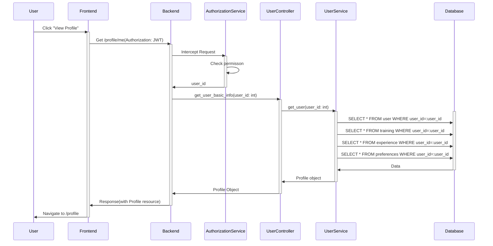

```mermaid
sequenceDiagram
    participant User
    participant Frontend
    participant BE as Backend
    participant AS as AuthorizationService
    participant UC as UserController
    participant US as UserService
    participant DB as Database
 

    User->>Frontend: Click "View Profile"
    
    activate Frontend
    Frontend->>BE: Get /profile/me(Authorization: JWT)
    
    activate BE
    BE->>AS: Intercept Request
    
    activate AS
    AS->>AS: Check permisson
    AS->>BE: user_id
    deactivate AS

    BE->>UC: get_user_basic_info(user_id: int)
    
    activate UC
    UC->>US: get_user(user_id: int)
    
    activate US
    activate DB
    US->>DB: SELECT * FROM user WHERE user_id=:user_id
    US->>DB: SELECT * FROM training WHERE user_id=:user_id
    US->>DB: SELECT * FROM experience WHERE user_id=:user_id
    US->>DB: SELECT * FROM preferences WHERE user_id=:user_id
    
    DB->>US: Data
    deactivate DB

    US->>UC: Profile object
    deactivate US

    UC->>BE: Profile Object
    deactivate UC

    BE->>Frontend: Response(with Profile resource)

    deactivate BE

    Frontend->>User: Navigate to /profile
    deactivate Frontend
```