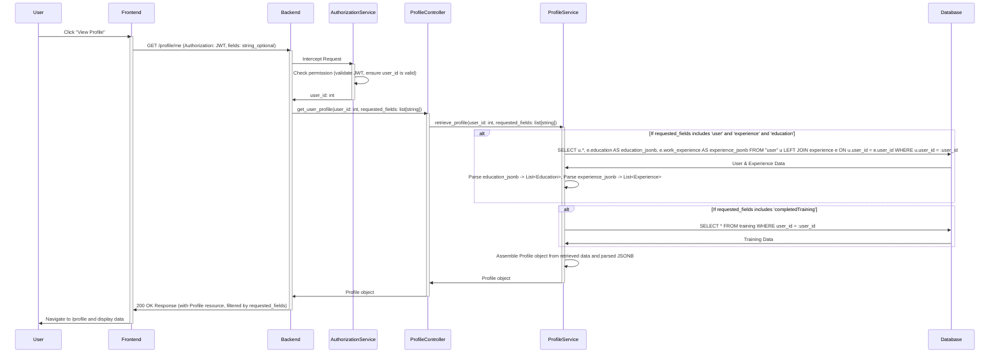

```mermaid
sequenceDiagram
    participant User
    participant Frontend
    participant BE as Backend
    participant AS as AuthorizationService
    participant PC as ProfileController
    participant PS as ProfileService
    participant DB as Database
 

    User->>Frontend: Click "View Profile"
    
    activate Frontend
    Frontend->>BE: GET /profile/me (Authorization: JWT, fields: string_optional)
    
    activate BE
    BE->>AS: Intercept Request
    
    activate AS
    AS->>AS: Check permission (validate JWT, ensure user_id is valid)
    AS->>BE: user_id: int
    deactivate AS

    BE->>PC: get_user_profile(user_id: int, requested_fields: list[string])
    
    activate PC
    PC->>PS: retrieve_profile(user_id: int, requested_fields: list[string])
    
    activate PS
    
    alt If requested_fields includes 'user' and 'experience' and 'education'
        PS->>DB: SELECT u.*, e.education AS education_jsonb, e.work_experience AS experience_jsonb FROM "user" u LEFT JOIN experience e ON u.user_id = e.user_id WHERE u.user_id = :user_id
        DB->>PS: User & Experience Data
        PS->>PS: Parse education_jsonb -> List<Education>, Parse experience_jsonb -> List<Experience>
    end
    
    alt If requested_fields includes 'completedTraining'
        PS->>DB: SELECT * FROM training WHERE user_id = :user_id
        DB->>PS: Training Data
    end
    
    PS->>PS: Assemble Profile object from retrieved data and parsed JSONB
    PS ->>PC: Profile object
    deactivate PS

    PC->>BE: Profile object
    deactivate PC

    BE->>Frontend: 200 OK Response (with Profile resource, filtered by requested_fields)

    deactivate BE

    Frontend->>User: Navigate to /profile and display data
    deactivate Frontend
```
